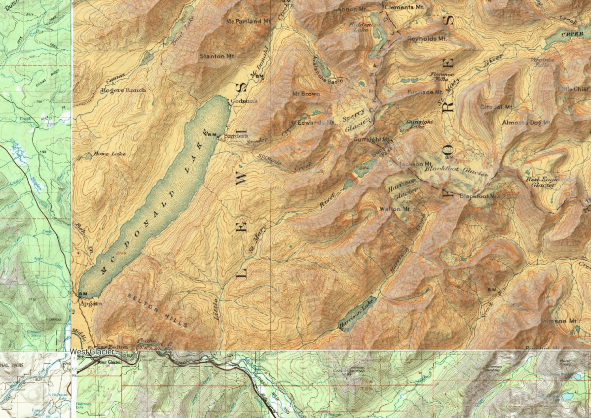

# usgs-topo-mosaic

A fork of [cogeo-mosaic-tiler][cogeo-mosaic-tiler] to serve USGS Historical
Topographic map tiles on demand from a mosaic of Cloud-Optimized GeoTIFFs.

[Demo][demo]



[cogeo-mosaic-tiler]: https://github.com/developmentseed/cogeo-mosaic-tiler
[demo]: https://kylebarron.dev/usgs-topo-mosaic
[mosaicjson]: https://github.com/developmentseed/mosaicjson-spec

## Overview

I stumbled upon a hidden gem: the entire USGS historical topographic map
archive, consisting of 183,112 digitized maps created between 1884 and 2006, is
stored in Cloud-Optimized GeoTIFF (COG) format on AWS S3.

The fact that maps are accessible publicly and stored in COG format means that
you can easily and cheaply set up a serverless function on AWS Lambda to serve
map tiles on the fly.

The [COG format][cogeo] is a backwards-compatible, cloud-native storage format
for raster files that allow selected portions of the file to be read over the
network without needing to download and parse the entire file. This fast random
read access allows for dynamic tiling of map tiles on demand, without needing to
preprocess and store any map data.

[cogeo]: https://www.cogeo.org/

There are three parts to serving your own tiles:

- [`usgs-topo-tiler`][usgs-topo-tiler]: a library to extract a _single_ Web Mercator tile from _one_ source historical map. You don't need to touch the library if you're using `usgs-topo-mosaic`.
- [`usgs-topo-tiler`][usgs-topo-tiler]'s CLI, which helps to construct MosaicJSON files. These files tell `usgs-topo-mosaic` what source files should be combined to create a single Web Mercator tile.
- `usgs-topo-mosaic`: a library to create image tiles on demand with AWS Lambda, using a MosaicJSON file created from `usgs-topo-tiler`.

[usgs-topo-tiler]: https://github.com/kylebarron/usgs-topo-tiler

## Deploy

You can deploy your own serverless map tile server with a few lines of code.

### Download

```bash
git clone https://github.com/kylebarron/usgs-topo-mosaic
cd usgs-topo-mosaic
```

### Create a lambda package

Package all dependencies into a file `package.zip` that's ready to be uploaded
and used on AWS Lambda. Requires GNU Make and Docker.

```bash
make package
```

#### Deploy to AWS

This project uses [Serverless][serverless_framework] to easily deploy on AWS.

[serverless_framework]: https://serverless.com

```bash
# Install and Configure serverless (https://serverless.com/framework/docs/providers/aws/guide/credentials/)
npm install serverless -g
sls deploy --bucket a-bucket-where-you-store-data
```

The function will be deployed in the `us-west-2` region, because that's where
the USGS's S3 bucket is located. Locating `usgs-topo-mosaic` makes requests
faster, as source data fetched from the origin bucket doesn't have to exit the
region, and also makes USGS's egress bandwidth costs lower.

## Using

See [/doc/API.md](/doc/API.md) for the documentation.

## About

Fork of [cogeo-mosaic-tiler][cogeo-mosaic-tiler].
